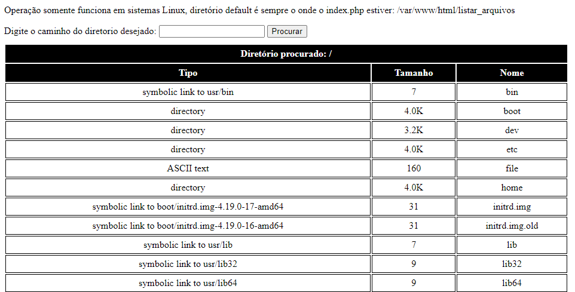

## Listar arquivo Linux + PHP

Utilizando do PHP para listar arquivos dentro do Linux

---

### Requisitos
* PHP 7.4 (Utilizado para os testes);
* Apache2 (Servidor Web);
* Host Linux (utilizado foi o Debian 10) (Computador que é o servidor Web);

---

### Comandos para instalar o ambiente
```
apt install php
apt install apache2 -y 
```
* PS: Valido somente a distros baseadas em debian;

---

### Demonstração da interface




